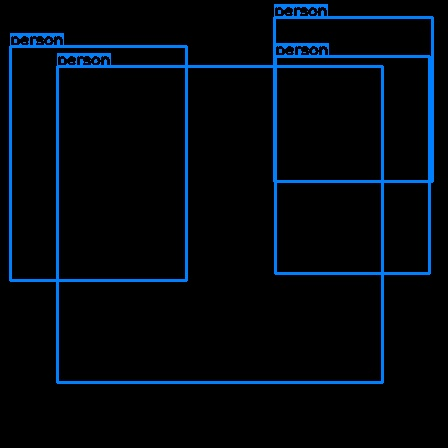
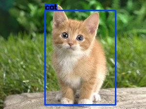
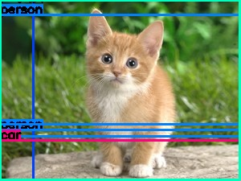
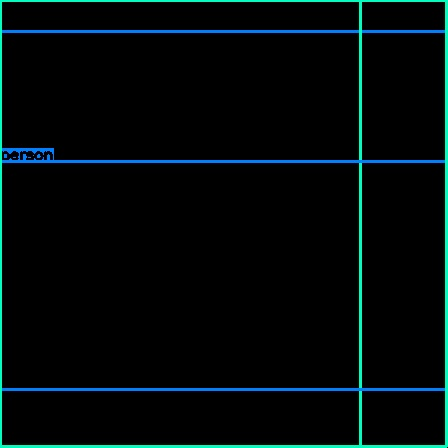

n# Project YOLO-TensorRT-GIE
This code is an implementation of trained YOLO neural network used with the TensorRT framework.  (YOLO : "You Only Look Once: Unified, Real-Time Object Detection" by Joseph Redmon, Santosh Divvala, Ross Girshick, Ali Farhadi).

There is issue with this implementation :  for now the output of the neural network isn't good and I am currently searching for the solution if you have any idea don't hesitate to create an issue.

The ouputed result for detecting a cat is : 

 
*Example of bad detection for a cat*

When the ouputed result with the very same network implemented with caffe gives : 

 
*True detection for a cat when the network is run with the caffe framework*

Furthermore a different images will gives very close results. For example with a matrice of zeros the result seems to be exactly the same. 

 
*Outputed detection for a matrice of zeros*

UPDATE :
As pointed out by AastaLLL at https://devtalk.nvidia.com/default/topic/990426/jetson-tx1/tensorrt-yolo-inference-error/post/5087820/ the leaky relu layer was not supported by TensorRT and should be remplaced  by standard-relu+scale+eltwise to approximate it. The results with the modified prototxt (yolo_small_modified.prototxt) are the following : 

The 32 bits versions of tensorRT gives similar results to caffe results with yolov1-small.

 
*Example of the 32 bits detection with modified prototxt*

But the result of the 16 bits version of tensorRT does not gives correct detections :

 
*Example of the 16 bits detection with modified prototxt*

 
*Example of the 16 bits detection with modified prototxt with a matrice of zeros*
