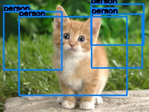
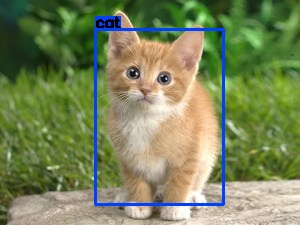

# Project YOLO-TensorRT-GIE
This code is an implementation of trained YOLO neural network used with the TensorRT framework.  (YOLO : "You Only Look Once: Unified, Real-Time Object Detection" by Joseph Redmon, Santosh Divvala, Ross Girshick, Ali Farhadi).

There is issue with this implementation :  for now the output of the neural network isn't good and I am currently searching for the solution if you have any idea don't hesitate to create an issue.

The ouputed result for detecting a cat is : 

 
*Example of bad detection for a cat*

When the ouputed result with the very same network implemented with caffe gives : 

 
*True detection for a cat when the network is run with the caffe framework*

Furthermore a very images will gives very close results. For example with a matrice of zeros the result seems to be exactly the same. 

 
*Outputed detection for a matrice of zeros*
